<div align="center">

<!-- ═══════════ ANIMATED PAC-MAN GAME ═══════════ -->

<a href="https://github.com/Abi-de-jo">
  
</a>

<br>

<!-- Typing banner -->
<a href="https://git.io/typing-svg">
  
</a>

<br><br>

<!-- Social badges -->
<a href="https://github.com/Abi-de-jo">
  
</a>
&nbsp;
<a href="https://discord.com/users/Abi-de-jo">
  
</a>
&nbsp;
<a href="https://linkedin.com/in/Abi-de-jo">
  
</a>
&nbsp;
<a href="mailto:contact@codebyabi.dev">
  
</a>

</div>

---

<!-- ════════════════ ABOUT + MAZE PANEL ════════════════ -->

<table>
<tr>
<td width="50%" valign="top" style="padding-right:20px;">

## 👨‍💻 About Me

```yaml
name: R.Abisheik
handle: Abi-de-jo
location: Chennai, TamilNadu
company: Sree-Cognicoders
blog: codebyabi.dev
joined: 2023
philosophy: "Clean code over clever code — always."
```

<br>

### <span style="color:#22d3ee">🎨 Frontend</span>
**React · TypeScript · Next.js**

### <span style="color:#22c55e">⚙️ Backend</span>
**Node.js · Express · MongoDB**

### <span style="color:#fb923c">🎯 Styling</span>
**HTML5 · CSS3 · Tailwind**

### <span style="color:#a855f7">🚀 Focus</span>
**Production-grade web applications**

</td>
<td width="50%" valign="top" style="padding-left:20px;">

<div align="center">

### 👻 The Stack — *Waka Waka Edition*

<br>

```
   · · · · · · 🟦🟦🟦🟦🟦 · · · 🟦🟦🟦🟦🟦 · · · · · ·
   ·     🟦     🟦              🟦     🟦
   🟡    🟦     [⚛ React]  [TS]     🟦    ·    👻
   ·     🟦     🟦              🟦     🟦
   · · · · · · 🟦🟦🟦🟦🟦 · · · 🟦🟦🟦🟦🟦 · · · · · ·
                  🟦                🟦
   [🟢 Node] [ex Express] [N Next]  🟦
   🟡        🟦         🟦         🟦    🟡
   · · · · ·🟦🟦🟦· · · · · · · ·🟦🟦🟦· · · · ·
                  [🍃 Mongo]
```

*🟡 = power-pellet ready · chasing down bugs daily*

</div>

</td>
</tr>
</table>

---

<!-- ════════════════ QUOTE ════════════════ -->

<div align="center">

> ### 🏆 *"Clean code over clever code — always."*

</div>

---

<!-- ════════════════ TECH STACK BADGES ════════════════ -->

## 🛠️️ Tech Stack

<div align="center">


</div>

---

<!-- ════════════════ GITHUB STATS ════════════════ -->

## 📊 GitHub Statistics

<div align="center">

<table>
  <tr>
    <td width="50%">
      
    </td>
    <td width="50%">
      
    </td>
  </tr>
</table>

<br>


</div>

---

<!-- ════════════════ ACTIVITY GRAPH ════════════════ -->

## 📈 Contribution Activity

<div align="center">


</div>

---

<!-- ════════════════ TROPHIES ════════════════ -->

## 🏆 Achievements

<div align="center">


<br><br>
<sub><i>Trophies auto-refresh via the GitHub Trophy API</i></sub>

</div>

---

<!-- ════════════════ PAC-MAN CONTRIBUTION GRAPH ════════════════ -->

## 👻 Pac-Man Contribution Graph

<div align="center">

<picture>
  <source media="(prefers-color-scheme: dark)" srcset="https://raw.githubusercontent.com/Abi-de-jo/Abi-de-jo/output/pacman-contribution-graph-dark.svg" />
  <source media="(prefers-color-scheme: light)" srcset="https://raw.githubusercontent.com/Abi-de-jo/Abi-de-jo/output/pacman-contribution-graph.svg" />
  
</picture>

<br>
<sub><i>👻 Pac-Man chases your contributions — auto-updated every 12 hours</i></sub>

</div>

---

<!-- ════════════════ TYPING BANNER ════════════════ -->

<div align="center">

<a href="https://git.io/typing-svg">
  
</a>

<br><br>

<sub>🟡 <b>WAKA WAKA</b> · built with ❤️ in Chennai · © R.Abisheik</sub>

</div>