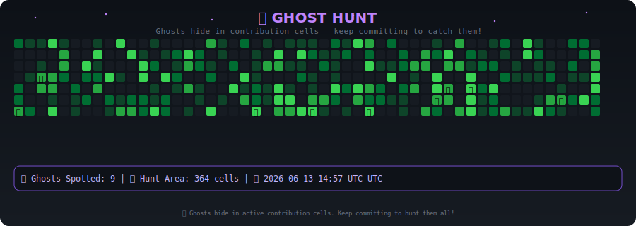

<div align="center">

# 👻 CodeByAbi

**FULL-STACK DEVELOPER · MERN STACK · OPEN SOURCE**

[](https://github.com/Abi-de-jo)
[](https://discord.com/users/Abi-de-jo)
[](https://linkedin.com/in/Abi-de-jo)

---

<!-- BANNER: Game title screen with animated character, stars, moon, and ghosts -->


---

## 🎮 Ghost Hunter — Live Commit Graph Game

<!-- GAME: Real-time platformer generated from your actual GitHub contributions -->


> *Your commits build the terrain. The Ghost Hunter runs, jumps, and collects ⭐ along your contribution graph.*
> <br>🔄 Updated every **4 hours** via GitHub Actions

---

## 👻 Legacy Ghost Hunt

<!-- LEGACY GAME: Snake-based ghost hunt overlay -->


> *Classic snake grid with 👻 haunting your most active cells.*
> <br>🔄 Updated **every hour**

---

## 🛠️ Tech Stack & Tools

<div align="center">


</div>

---

## 📊 Contribution Statistics

<div align="center">

<!-- GitHub Stats Cards with purple theme -->


<br>


</div>

---

## 🏆 Trophy Case

<div align="center">

[](https://github.com/ryo-ma/github-profile-trophy)

</div>

---

## 🎯 Recent Activity

<!--RECENT_ACTIVITY:start-->
<!-- Automatically updated by GitHub Actions -->
<!--RECENT_ACTIVITY:end-->

---

## 🌙 About Me

```text
👻 Role      : Ghost Developer (Full-Stack)
🎮 Stack     : MERN (MongoDB, Express, React, Node.js)
💻 Currently : Building production-grade web applications
🏆 Goal      : Clean code, scalable architecture, great UX
🎯 Level     : Enterprise-Ready
```

---

<div align="center">

*This profile README regenerates automatically every 4 hours —*  
*because even ghosts need to keep their game sharp.* 👻

**© 2025 CodeByAbi · Made with 💜 and too much coffee**

</div>
