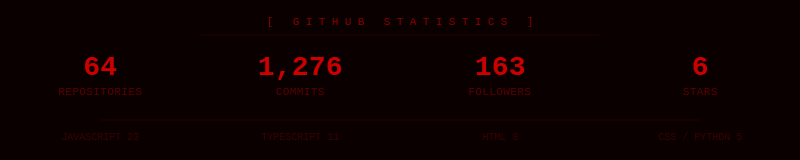
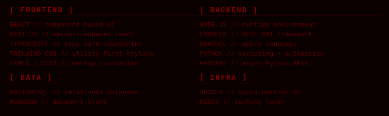

<!-- HORROR THEME WRAPPER - extends full width to cover grey GitHub background -->
<div style="background-color:#0a0000;background-image:linear-gradient(180deg, #0a0000 0%, #1a0505 100%);padding:0;border-radius:8px;border:1px solid #3a0000;">

<!-- GIANT HORROR HERO - fills the visible top of profile with horror bg -->
<p align="center" style="margin:0;padding:0;line-height:0;">
  
</p>

<div style="padding:40px;">


<p align="center">
  
</p>

<br/>

<!-- STATS -->
<p align="center">
  
</p>

<br/>

<!-- DIVIDER 1 -->
<p align="center">
  
</p>

<br/>

<!-- THE DEVELOPER -->
<div style="background-color:#1a0505;padding:25px;border-radius:6px;border:1px solid #5a0000;margin:20px 0;">

<h2 align="center" style="color:#cc0000;font-family:monospace;letter-spacing:6px;font-size:24px;margin:0 0 20px 0;">THE DEVELOPER</h2>

<div style="background-color:#0a0000;padding:20px;border-radius:4px;border:1px solid #3a0000;font-family:monospace;color:#aa0000;font-size:14px;line-height:1.6;">

```
> whoami
```

<span style="color:#ff0000;font-weight:bold;">R.Abisheik</span> <span style="color:#5a0000;">// full-stack developer</span>
<span style="color:#5a0000;">location:</span> <span style="color:#aa0000;">tamilnadu, india</span>
<span style="color:#5a0000;">status:</span> <span style="color:#aa0000;">coding after midnight</span>
<span style="color:#5a0000;">fears:</span> <span style="color:#aa0000;">null</span>
<span style="color:#5a0000;">coffee:</span> <span style="color:#aa0000;">black as my soul</span>

</div>

<br/>

<div style="background-color:#0a0000;padding:20px;border-radius:4px;border:1px solid #3a0000;font-family:monospace;color:#aa0000;font-size:14px;line-height:1.8;">

I build production-grade systems for the modern web. <span style="color:#ff0000;">React, TypeScript, Node.js, PostgreSQL, MongoDB, Prisma.</span> The full stack. Frontend to backend, infrastructure to deployment. No frameworks I cannot defend. No language I cannot pick up. I ship code that works in production -- not just on my machine.

As a core contributor at <span style="color:#ff0000;font-weight:bold;">Sree-Cognicoders</span>, I architect and ship enterprise systems handling real-world complexity: identity management, queue monitoring, time tracking, visitor management. The kind of systems that fail in production if you are not careful. I am careful.

I also teach. Over <span style="color:#ff0000;font-weight:bold;">50 students</span> trained in full-stack development. The next generation of engineers will be better than me. That is the goal.

</div>

</div>

<br/>

<!-- DIVIDER COFFIN -->
<p align="center">
  
</p>

<br/>

<!-- THE STACK -->
<h2 align="center" style="color:#cc0000;font-family:monospace;letter-spacing:6px;font-size:24px;margin:20px 0;">THE STACK</h2>

<p align="center">
  
</p>

<br/>

<!-- DIVIDER 1 -->
<p align="center">
  
</p>

<br/>

<!-- THE CORPSE COUNT -->
<h2 align="center" style="color:#cc0000;font-family:monospace;letter-spacing:6px;font-size:24px;margin:20px 0;">THE CORPSE COUNT</h2>

<div style="background-color:#1a0505;padding:5px;border-radius:6px;border:1px solid #5a0000;">

<table style="width:100%;border-collapse:collapse;font-family:monospace;">
<thead>
<tr style="background-color:#3a0000;color:#ff0000;">
<th align="left" style="padding:12px;border:1px solid #5a0000;color:#ff0000;">PROJECT</th>
<th align="left" style="padding:12px;border:1px solid #5a0000;color:#ff0000;">STACK</th>
<th align="left" style="padding:12px;border:1px solid #5a0000;color:#ff0000;">PURPOSE</th>
</tr>
</thead>
<tbody style="color:#aa0000;">
<tr style="background-color:#0a0000;">
<td style="padding:10px;border:1px solid #3a0000;"><a href="https://github.com/Abi-de-jo/Fahh" style="color:#ff0000;text-decoration:none;"><b>Fahh</b></a></td>
<td style="padding:10px;border:1px solid #3a0000;color:#aa0000;">TypeScript</td>
<td style="padding:10px;border:1px solid #3a0000;color:#aa0000;">VS Code extension. Plays a sound when errors appear. Catch bugs by ear, not by sight.</td>
</tr>
<tr style="background-color:#1a0505;">
<td style="padding:10px;border:1px solid #3a0000;"><a href="https://github.com/Abi-de-jo/Fitmachi" style="color:#ff0000;text-decoration:none;"><b>Fitmachi</b></a></td>
<td style="padding:10px;border:1px solid #3a0000;color:#aa0000;">TypeScript</td>
<td style="padding:10px;border:1px solid #3a0000;color:#aa0000;">Fitness tracking. Workout planning. Progress analytics.</td>
</tr>
<tr style="background-color:#0a0000;">
<td style="padding:10px;border:1px solid #3a0000;"><a href="https://github.com/Abi-de-jo/AiMock_Interview" style="color:#ff0000;text-decoration:none;"><b>AiMock Interview</b></a></td>
<td style="padding:10px;border:1px solid #3a0000;color:#aa0000;">JavaScript</td>
<td style="padding:10px;border:1px solid #3a0000;color:#aa0000;">AI-powered mock interview. Real-time practice with feedback.</td>
</tr>
<tr style="background-color:#1a0505;">
<td style="padding:10px;border:1px solid #3a0000;"><a href="https://github.com/Abi-de-jo/releasenotepro" style="color:#ff0000;text-decoration:none;"><b>ReleaseNotePro</b></a></td>
<td style="padding:10px;border:1px solid #3a0000;color:#aa0000;">Multi-Agent AI</td>
<td style="padding:10px;border:1px solid #3a0000;color:#aa0000;">Automated release notes. Multi-agent intelligence.</td>
</tr>
<tr style="background-color:#0a0000;">
<td style="padding:10px;border:1px solid #3a0000;"><a href="https://github.com/Abi-de-jo/Wedding-invitation" style="color:#ff0000;text-decoration:none;"><b>Wedding Invitation</b></a></td>
<td style="padding:10px;border:1px solid #3a0000;color:#aa0000;">TypeScript</td>
<td style="padding:10px;border:1px solid #3a0000;color:#aa0000;">Interactive wedding invitation with RSVP and gallery.</td>
</tr>
<tr style="background-color:#1a0505;">
<td style="padding:10px;border:1px solid #3a0000;"><a href="https://github.com/Abi-de-jo/NailsByShmatko" style="color:#ff0000;text-decoration:none;"><b>NailsByShmatko</b></a></td>
<td style="padding:10px;border:1px solid #3a0000;color:#aa0000;">Next.js</td>
<td style="padding:10px;border:1px solid #3a0000;color:#aa0000;">Salon booking platform. Portfolio for nail artists.</td>
</tr>
<tr style="background-color:#0a0000;">
<td style="padding:10px;border:1px solid #3a0000;"><a href="https://github.com/Abi-de-jo/Freelance_photography" style="color:#ff0000;text-decoration:none;"><b>Freelance Photography</b></a></td>
<td style="padding:10px;border:1px solid #3a0000;color:#aa0000;">TypeScript</td>
<td style="padding:10px;border:1px solid #3a0000;color:#aa0000;">Photography platform. Freelancers and clients connected.</td>
</tr>
<tr style="background-color:#1a0505;">
<td style="padding:10px;border:1px solid #3a0000;"><a href="https://github.com/Abi-de-jo/codebyabi-portfolio" style="color:#ff0000;text-decoration:none;"><b>CodeByAbi Portfolio</b></a></td>
<td style="padding:10px;border:1px solid #3a0000;color:#aa0000;">HTML/CSS/JS</td>
<td style="padding:10px;border:1px solid #3a0000;color:#aa0000;">Personal portfolio. Projects and experiments.</td>
</tr>
<tr style="background-color:#0a0000;">
<td style="padding:10px;border:1px solid #3a0000;"><a href="https://github.com/Abi-de-jo/graphql" style="color:#ff0000;text-decoration:none;"><b>GraphQL Playground</b></a></td>
<td style="padding:10px;border:1px solid #3a0000;color:#aa0000;">GraphQL</td>
<td style="padding:10px;border:1px solid #3a0000;color:#aa0000;">API exploration and implementation patterns.</td>
</tr>
<tr style="background-color:#1a0505;">
<td style="padding:10px;border:1px solid #3a0000;"><a href="https://github.com/Abi-de-jo/batch-4" style="color:#ff0000;text-decoration:none;"><b>Batch-4</b></a></td>
<td style="padding:10px;border:1px solid #3a0000;color:#aa0000;">Full-Stack</td>
<td style="padding:10px;border:1px solid #3a0000;color:#aa0000;">Full-stack curriculum. 50+ students trained.</td>
</tr>
</tbody>
</table>

</div>

<br/>

<!-- DIVIDER COFFIN -->
<p align="center">
  
</p>

<br/>

<!-- THE ORDER -->
<h2 align="center" style="color:#cc0000;font-family:monospace;letter-spacing:6px;font-size:24px;margin:20px 0;">THE ORDER</h2>

<p align="center" style="color:#aa0000;font-family:monospace;font-size:14px;">Production systems built at Sree-Cognicoders</p>

<div style="background-color:#1a0505;padding:5px;border-radius:6px;border:1px solid #5a0000;">

<table style="width:100%;border-collapse:collapse;font-family:monospace;">
<thead>
<tr style="background-color:#3a0000;">
<th align="left" style="padding:12px;border:1px solid #5a0000;color:#ff0000;">SYSTEM</th>
<th align="left" style="padding:12px;border:1px solid #5a0000;color:#ff0000;">ROLE</th>
<th align="left" style="padding:12px;border:1px solid #5a0000;color:#ff0000;">STACK</th>
</tr>
</thead>
<tbody style="color:#aa0000;">
<tr style="background-color:#0a0000;"><td style="padding:10px;border:1px solid #3a0000;"><b style="color:#ff0000;">Chronologix</b> <span style="color:#5a0000;">// Time & Attendance</span></td><td style="padding:10px;border:1px solid #3a0000;color:#aa0000;">FE + BE</td><td style="padding:10px;border:1px solid #3a0000;color:#aa0000;">TypeScript, Node, MySQL</td></tr>
<tr style="background-color:#1a0505;"><td style="padding:10px;border:1px solid #3a0000;"><b style="color:#ff0000;">Chronexa</b> <span style="color:#5a0000;">// Enterprise Platform</span></td><td style="padding:10px;border:1px solid #3a0000;color:#aa0000;">FE + BE</td><td style="padding:10px;border:1px solid #3a0000;color:#aa0000;">TypeScript, React, Node</td></tr>
<tr style="background-color:#0a0000;"><td style="padding:10px;border:1px solid #3a0000;"><b style="color:#ff0000;">Identra</b> <span style="color:#5a0000;">// Identity Management</span></td><td style="padding:10px;border:1px solid #3a0000;color:#aa0000;">FE + BE</td><td style="padding:10px;border:1px solid #3a0000;color:#aa0000;">TypeScript, Express</td></tr>
<tr style="background-color:#1a0505;"><td style="padding:10px;border:1px solid #3a0000;"><b style="color:#ff0000;">Visitor Management</b></td><td style="padding:10px;border:1px solid #3a0000;color:#aa0000;">FE + BE</td><td style="padding:10px;border:1px solid #3a0000;color:#aa0000;">TypeScript, React, Node</td></tr>
<tr style="background-color:#0a0000;"><td style="padding:10px;border:1px solid #3a0000;"><b style="color:#ff0000;">QMS</b> <span style="color:#5a0000;">// Queue Management</span></td><td style="padding:10px;border:1px solid #3a0000;color:#aa0000;">FE + BE</td><td style="padding:10px;border:1px solid #3a0000;color:#aa0000;">TypeScript</td></tr>
<tr style="background-color:#1a0505;"><td style="padding:10px;border:1px solid #3a0000;"><b style="color:#ff0000;">Onesuite</b> <span style="color:#5a0000;">// All-in-one App</span></td><td style="padding:10px;border:1px solid #3a0000;color:#aa0000;">FE + BE</td><td style="padding:10px;border:1px solid #3a0000;color:#aa0000;">TypeScript</td></tr>
<tr style="background-color:#0a0000;"><td style="padding:10px;border:1px solid #3a0000;"><b style="color:#ff0000;">Ghobase</b> <span style="color:#5a0000;">// Notifications & Jobs</span></td><td style="padding:10px;border:1px solid #3a0000;color:#aa0000;">Backend</td><td style="padding:10px;border:1px solid #3a0000;color:#aa0000;">TypeScript, Node.js</td></tr>
<tr style="background-color:#1a0505;"><td style="padding:10px;border:1px solid #3a0000;"><b style="color:#ff0000;">Meal Management</b></td><td style="padding:10px;border:1px solid #3a0000;color:#aa0000;">FE + BE</td><td style="padding:10px;border:1px solid #3a0000;color:#aa0000;">TypeScript</td></tr>
<tr style="background-color:#0a0000;"><td style="padding:10px;border:1px solid #3a0000;"><b style="color:#ff0000;">Time Tracking</b></td><td style="padding:10px;border:1px solid #3a0000;color:#aa0000;">FE + BE</td><td style="padding:10px;border:1px solid #3a0000;color:#aa0000;">TypeScript, React</td></tr>
<tr style="background-color:#1a0505;"><td style="padding:10px;border:1px solid #3a0000;"><b style="color:#ff0000;">Intranet Portal</b></td><td style="padding:10px;border:1px solid #3a0000;color:#aa0000;">FE + BE</td><td style="padding:10px;border:1px solid #3a0000;color:#aa0000;">TypeScript</td></tr>
</tbody>
</table>

</div>

<br/>

<!-- DIVIDER 1 -->
<p align="center">
  
</p>

<br/>

<!-- THE GRAVEYARD -->
<h2 align="center" style="color:#cc0000;font-family:monospace;letter-spacing:6px;font-size:24px;margin:20px 0;">THE GRAVEYARD</h2>

<p align="center" style="color:#aa0000;font-family:monospace;font-size:14px;">The contribution graph rendered as a haunted graveyard. Every commit is a tombstone. Maximum activity days rise as skulls. Bats swarm across the blood moon. The hooded wanderer traverses the path of code.</p>

<p align="center">
  <picture>
    <source media="(prefers-color-scheme: dark)" srcset="https://raw.githubusercontent.com/Abi-de-jo/Abi-de-jo/output/horror.svg"/>
    <source media="(prefers-color-scheme: light)" srcset="https://raw.githubusercontent.com/Abi-de-jo/Abi-de-jo/output/horror.svg"/>
    
  </picture>
</p>

<br/>

<!-- DIVIDER 1 -->
<p align="center">
  
</p>

<br/>

<!-- THE RITUALS -->
<h2 align="center" style="color:#cc0000;font-family:monospace;letter-spacing:6px;font-size:24px;margin:20px 0;">THE RITUALS</h2>

<div style="background-color:#0a0000;padding:20px;border-radius:4px;border:1px solid #3a0000;font-family:monospace;color:#aa0000;font-size:14px;line-height:1.8;">

```
> ps aux | grep abi
```

<span style="color:#5a0000;">instagram --></span> <a href="https://instagram.com/codebyabi" style="color:#ff0000;text-decoration:none;">instagram.com/codebyabi</a>
<span style="color:#5a0000;">youtube   --></span> <a href="https://youtube.com/codebyabi" style="color:#ff0000;text-decoration:none;">youtube.com/codebyabi</a>
<span style="color:#5a0000;">linkedin  --></span> <a href="https://linkedin.com/in/codebyabisheik/" style="color:#ff0000;text-decoration:none;">linkedin.com/in/codebyabisheik</a>
<span style="color:#5a0000;">email     --></span> <a href="mailto:abisheikabisheik102@gmail.com" style="color:#ff0000;text-decoration:none;">abisheikabisheik102@gmail.com</a>

</div>

<br/>

<!-- DIVIDER COFFIN -->
<p align="center">
  
</p>

<br/>

<!-- THE ALTAR -->
<h2 align="center" style="color:#cc0000;font-family:monospace;letter-spacing:6px;font-size:24px;margin:20px 0;">THE ALTAR</h2>

<div style="background-color:#1a0505;padding:5px;border-radius:6px;border:1px solid #5a0000;">

<table style="width:100%;border-collapse:collapse;font-family:monospace;">
<tbody style="color:#aa0000;">
<tr style="background-color:#0a0000;"><td style="padding:12px;border:1px solid #3a0000;color:#5a0000;width:30%;"><b style="color:#ff0000;">MACHINE</b></td><td style="padding:12px;border:1px solid #3a0000;">Lenovo IdeaPad Slim 3</td></tr>
<tr style="background-color:#1a0505;"><td style="padding:12px;border:1px solid #3a0000;color:#5a0000;"><b style="color:#ff0000;">CPU</b></td><td style="padding:12px;border:1px solid #3a0000;">AMD Ryzen 5 4600U</td></tr>
<tr style="background-color:#0a0000;"><td style="padding:12px;border:1px solid #3a0000;color:#5a0000;"><b style="color:#ff0000;">GPU</b></td><td style="padding:12px;border:1px solid #3a0000;">Radeon Integrated Graphics</td></tr>
<tr style="background-color:#1a0505;"><td style="padding:12px;border:1px solid #3a0000;color:#5a0000;"><b style="color:#ff0000;">RAM</b></td><td style="padding:12px;border:1px solid #3a0000;">8GB DDR4</td></tr>
<tr style="background-color:#0a0000;"><td style="padding:12px;border:1px solid #3a0000;color:#5a0000;"><b style="color:#ff0000;">OS</b></td><td style="padding:12px;border:1px solid #3a0000;">Windows 11 / WSL2 Ubuntu</td></tr>
<tr style="background-color:#1a0505;"><td style="padding:12px;border:1px solid #3a0000;color:#5a0000;"><b style="color:#ff0000;">EDITOR</b></td><td style="padding:12px;border:1px solid #3a0000;">VS Code</td></tr>
<tr style="background-color:#0a0000;"><td style="padding:12px;border:1px solid #3a0000;color:#5a0000;"><b style="color:#ff0000;">THEME</b></td><td style="padding:12px;border:1px solid #3a0000;">Dark. Always dark.</td></tr>
</tbody>
</table>

</div>

<br/>

<!-- DIVIDER 1 -->
<p align="center">
  
</p>

<br/>

<!-- FOOTER -->
<div align="center" style="background-color:#0a0000;padding:30px;border-radius:6px;border:1px solid #3a0000;">

<div style="background-color:#1a0505;padding:15px;border-radius:4px;border:1px solid #3a0000;display:inline-block;font-family:monospace;color:#aa0000;font-size:14px;">
&gt; exit
</div>

<br/>

<p style="font-family:monospace;color:#5a0000;font-size:13px;font-style:italic;">"First, solve the problem. Then, write the code." -- John Johnson</p>

</div>

</div>
</div>
<!-- END HORROR THEME WRAPPER -->
