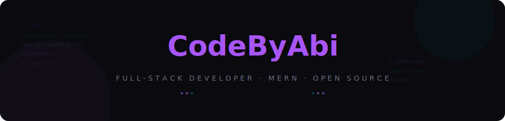

<div align="center">

# 𝐂𝐨𝐝𝐞𝐁𝐲𝐀𝐛𝐢

<sup><i>full-stack developer · open source · clean code</i></sup>

<br>

<a href="https://git.io/typing-svg"></a>

<br>

[](https://github.com/Abi-de-jo)
[](https://discord.com/users/Abi-de-jo)
[](https://linkedin.com/in/Abi-de-jo)
[](mailto:contact@codebyabi.dev)

</div>

---

<!-- CUSTOM BANNER -->


---

## 👨‍💻 About Me

```yaml
name: Abi
role: Full-Stack Developer
stack:
  - React / TypeScript
  - Node.js / Express
  - MongoDB
focus: Building production-grade web applications
philosophy: "Clean code over clever code — always."
```

---

## 🛠️ Tech Stack

<div align="center">

[](https://skillicons.dev)

</div>

---

## 📊 GitHub Analytics

<div align="center">

<a href="https://github.com/Abi-de-jo">
  
  
</a>

<br>

<a href="https://github.com/Abi-de-jo">
  
</a>

</div>

---

## 🏆 Achievements

<div align="center">

[](https://github.com/ryo-ma/github-profile-trophy)

</div>

---

## 🐍 Contribution Graph

<div align="center">

<!-- Contribution snake animation generated by Platane/snk -->
<picture>
  <source media="(prefers-color-scheme: dark)" srcset="assets/snake-dark.svg" />
  <source media="(prefers-color-scheme: light)" srcset="assets/snake-light.svg" />
  
</picture>

<br>
<sub><i>🐍 My contributions sneak around the grid — updated daily</i></sub>

</div>

---

## 📌 Recent Activity

<!--RECENT_ACTIVITY:start-->
<!--RECENT_ACTIVITY:end-->

---

<div align="center">


</div>
